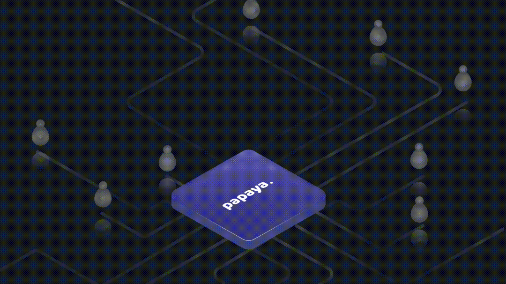

# Introduction

<figure><figcaption></figcaption></figure>

Papaya is an infrastructure for stablecoin payments that enables businesses to accept recurring payments and subscriptions in crypto. Our subscription protocol enables real-time balance calculations for any user without the need to iterate through all incoming streams. This means you can manage subscriptions for millions of users without enumerating each individul stream. The cost of collecting assets from millions of streams is as efficient as collecting from ten or a thousand streams.

### **Key Features**

* **Unlimited Subscriptions**: Handle thousands to millions of subscriptions with minimal transaction costs.
* **Real-Time Payment Streaming**: Enable continuous cash flow for businesses.
* **Multi-Chain Support**: Compatible with major blockchain networks (Ethereum, Polygon, BNB Chain, etc.).
* **Stablecoin Integration**: Native support for USDT, USDC, and PYUSD.
* **Non-Custodial Solution**: Direct wallet integration ensures user control over funds.
* **Complete Transparency**: Monitor transactions in real time with full visibility.

### **How It Works**

#### **For Businesses**

1. **Connect** your wallet to the Papaya protocol.
2. **Access** the management dashboard for subscription and transaction tracking.
3. **Integrate** the Papaya payment widget into your checkout system.
4. **Start Accepting** streaming payments.

#### **For Customers**

1. **Select** Papaya as the payment method at checkout.
2. **Connect** your crypto wallet (e.g., MetaMask).
3. **Choose** a payment frequency (e.g., daily, weekly, monthly).
4. **Activate** the subscription with a one-time gas fee.

### **Why Choose Papaya?**

* **Efficiency**: Save on gas fees by bundling transactions.
* **Scalability**: Designed to support millions of users without compromising performance.
* **User Control**: Transparent, real-time streaming with full control over payments.
* **Cost Savings**: Minimize transaction costs for both businesses and customers.


[getting-started](getting-started/)


