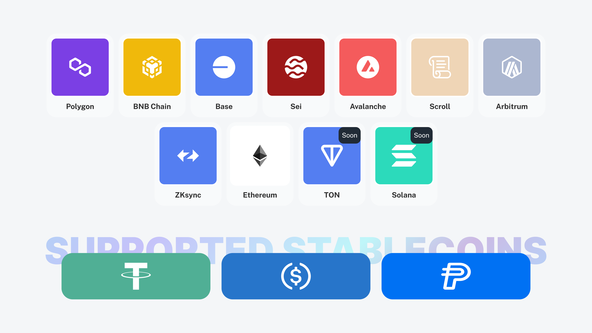

# Supported Networks

Papaya is designed to operate seamlessly across multiple blockchain networks, providing flexibility and scalability for businesses and users.

***

### **Currently Supported Networks**

<mark style="color:red;">**TODO: дублируется**</mark>

Papaya is deployed on the following major blockchain networks:

* Ethereum
* Polygon
* BNB Chain
* Arbitrum
* Avalanche
* Base
* Scroll
* zkSync

<figure><figcaption></figcaption></figure>

***

### **Coming Soon**

We are continuously expanding our network compatibility. The following chains are currently in development:

* **TON**
* **TRON**
* **Solana**

***

### **Why Multi-Chain Support Matters**

1. **Flexibility**:\
   Businesses and users can choose the network that best suits their needs, based on cost, speed, and scalability.
2. **Lower Costs**:\
   By leveraging networks with lower transaction fees, businesses can save money on operational costs.
3. **Broader Reach**:\
   Supporting multiple networks ensures compatibility with a wide range of wallets and decentralized applications.
4. **Scalability**:\
   Multi-chain architecture allows Papaya to handle a growing number of users and transactions seamlessly.

***

Papaya’s multi-chain support ensures that businesses and users can operate efficiently and effectively in a diverse blockchain ecosystem.
