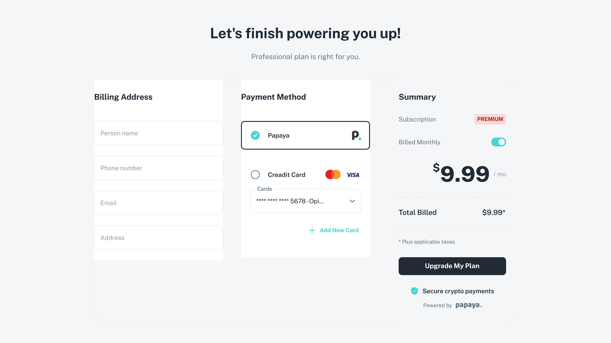

# Getting Started

Welcome to Papaya! This guide will help merchants set up and start using Papaya to accept stablecoin subscriptions.

### **For M**erchants

#### **1. Initial Setup**

* Submit Onboarding Form – Fill out the Google Form to share basic details about your project.
* Receive Project ID – After review, you’ll be assigned a unique Project ID.
* Access Integration Options – Use your Project ID with the Papaya SDK or connect directly to our smart contracts.

***

#### **2. Integration Steps**

* SDK Integration – Recommended for most merchants. Add the Papaya SDK to your checkout.
* Smart Contract Integration – For advanced teams needing direct on-chain interaction.
* Configure & Test – Set up subscription tiers, test transactions, and confirm that everything works as expected.

***

#### **3. Go Live**

* Deploy – Launch the integrated solution on your platform.
* Monitor Subscriptions – Track payments and balances in real time.
* Manage Streams – Update or cancel subscriptions directly through the protocol.
* Get Support – Contact the Papaya team for technical or business assistance.

***

### **For Customers**

Here is a quick step-by-step guide for customers using Papaya:

* **Select Papaya at Checkout**\
  When you’re ready to pay or subscribe, choose Papaya as your payment method.

<figure><figcaption></figcaption></figure>

* **Connect Your Wallet**\
  Connect your wallet (e.g., MetaMask, WalletConnect, or another supported option).

{% embed url="https://files.gitbook.com/v0/b/gitbook-x-prod.appspot.com/o/spaces%2FcrhGDzgi59PyfFaJtlVP%2Fuploads%2FGs2LX3v2oP1s6817jvBz%2FWallet%20connect.mp4?alt=media&token=e8b4d22b-91e5-48d9-9a5e-e58e8d558a95" %}

* **Deposit (Top Up the Protocol)**\
  Deposit funds into the protocol so you have enough balance to cover your subscription payments.

{% embed url="https://files.gitbook.com/v0/b/gitbook-x-prod.appspot.com/o/spaces%2FcrhGDzgi59PyfFaJtlVP%2Fuploads%2F7psG56b1RiIuSJNCyO4u%2FDepositing.mp4?alt=media&token=3330f1f0-7b86-4f66-89c4-aa83f13c907d" %}

* **Create a Stream (Subscribe)**\
  Create a stream (subscription) by specifying the required parameters (amount, duration, payment frequency, etc.).

{% embed url="https://files.gitbook.com/v0/b/gitbook-x-prod.appspot.com/o/spaces%2FcrhGDzgi59PyfFaJtlVP%2Fuploads%2FhKeLWdSPBl7pIIRV8GvU%2FStream%20creation.mp4?alt=media&token=0c88d3d6-b82d-4d94-9c9f-bab0a5792e42" %}

* **Stream Changing**\
  If needed, you can modify an existing subscription — update the terms, change the amount, or adjust the schedule.

{% embed url="https://files.gitbook.com/v0/b/gitbook-x-prod.appspot.com/o/spaces%2FcrhGDzgi59PyfFaJtlVP%2Fuploads%2FrdTNwp6IdGuSNfeGHPjj%2FStream%20changing.mp4?alt=media&token=c8dc2ec2-a6e7-4f1f-91a8-e6ae463e8cc0" %}

* **Cancel Subscription**\
  Should you no longer need the service, cancel your subscription at any time to stop any future charges.

{% embed url="https://files.gitbook.com/v0/b/gitbook-x-prod.appspot.com/o/spaces%2FcrhGDzgi59PyfFaJtlVP%2Fuploads%2FXWVWlfuyYBAvyprgdN5P%2FStream%20Revoking.mp4?alt=media&token=6937d22f-6357-4e2e-b5aa-148625af8386" %}

***

By following these steps, businesses can efficiently set up Papaya, and customers can enjoy a smooth and transparent subscription experience.
