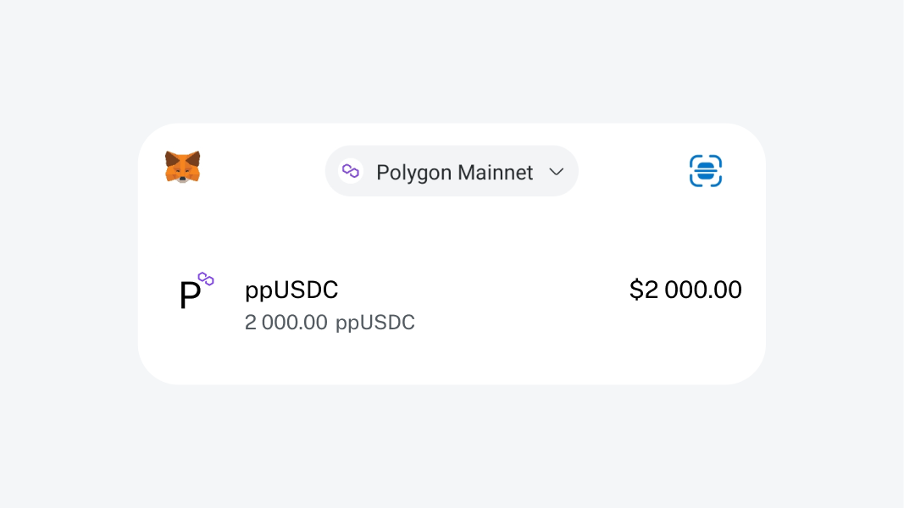

# Interaction

<figure><figcaption></figcaption></figure>

For user convenience, Papaya supports integration with all existing wallets through the use of standard ERC20 methods: _balanceOf_, _name_, _symbol_, and _decimals_. When funds are deposited into the contract, an abstract token _pp\*_ (where _\*_ is the original token's name) will appear in the user's wallet.


By abstract, we mean that no new tokens are created; instead, we mimic the token. This allows you to add Papaya as a token to your wallet and track your balance seamlessly.



[subscription-management.md](protocol/core-functions/subscription-management.md)



[Broken link](broken-reference)

