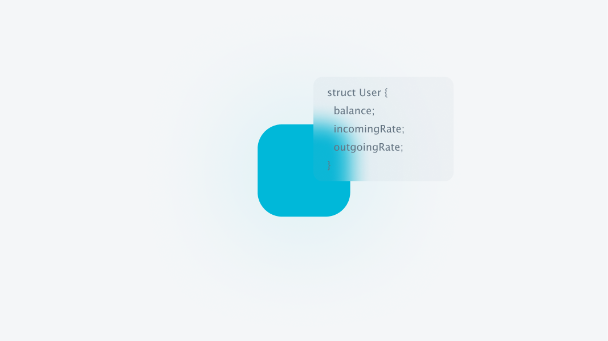

# Advanced Section

<figure><figcaption></figcaption></figure>

This section outlines the operational details and the process for obtaining the required user data.


[subscriptions.md](subscriptions.md)



[projects.md](projects.md)



[signatures.md](signatures.md)

