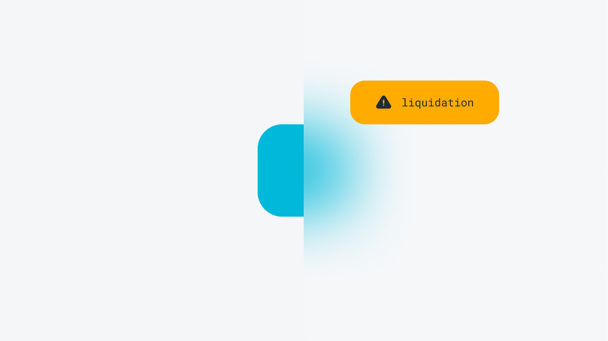

# Liquidations

<figure><figcaption></figcaption></figure>

Do not be alarmed by the term "liquidation." In this context, it means disabling user subscriptions. The user will be prevented from further spending, but their incoming streams will remain active, allowing them to continue earning.

This mechanism is necessary due to the inability to accurately assess the overall connectivity between subscribers and authors on the blockchain. Without it, a user who fails to replenish their balance could spend non-existent funds, potentially causing financial issues for other users.&#x20;

To prevent this, we use liquidators—special services that monitor each user's balance off-chain. If a user has only one day of spending left, the liquidator disables the user's subscriptions and receives a reward equivalent to the user's balance for that day.

To utilize this functionality, call the `liquidate` method. This will automatically verify the liquidator’s assumption and perform the liquidation if confirmed.

```solidity
function liquidate(address user)
```


Note anybody can be a liquidator, even you

